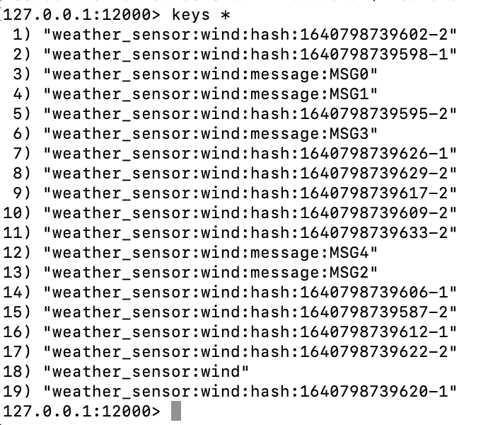
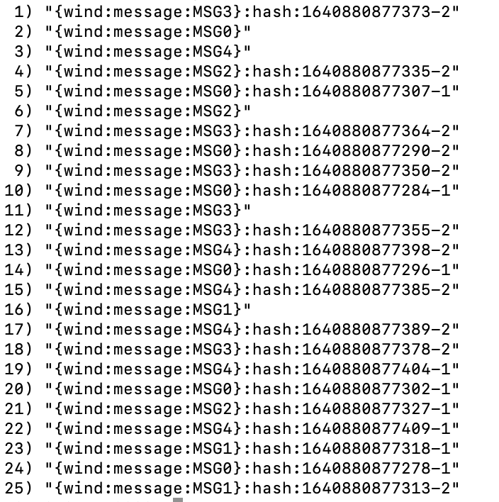

# redisSMSLuaA-A
Provides a quick-start example of using Redis Streams for parsing incoming messages in an active/active redis enterprise.
## Overview
A java producer will produce messages on a redis stream across two redis clusters in an active/active database.
A java consumer will consume from the stream and create redis structures from the streams messages.
Both a simple consumer and a consumer using LUA to eliminate round trips to the client java application are available.

## Redis Advantages for message partition streaming
 * Redis easily handles high write transaction volume
 * Redis enterprise scales vertically (large nodes)  and horizontally (many nodes)
 * Redis enterprise active/active allows adding to a stream from either "region"
 * Redis allows putting TTL on the hash

## Requirements
* Docker installed on your local system, see [Docker Installation Instructions](https://docs.docker.com/engine/installation/).

* When using Docker for Mac or Docker for Windows, the default resources allocated to the linux VM running docker are 2GB RAM and 2 CPU's. Make sure to adjust these resources to meet the resource requirements for the containers you will be running. More information can be found here on adjusting the resources allocated to docker.

[Docker for mac](https://docs.docker.com/docker-for-mac/#advanced)

[Docker for windows](https://docs.docker.com/docker-for-windows/#advanced)

## Links that help!
 * [Active/Active docker under crdt-application](https://github.com/RedisLabs/redis-for-dummies)
 * [Getting Started with Redis Streams and java github](https://github.com/tgrall/redis-streams-101-java)
 * [Stackoverflow LUA with DICT](https://stackoverflow.com/questions/58999662/redis-how-to-hmset-a-dictionary-from-a-lua-script)
 * [Redis Active/Active CLI reference](https://docs.redis.com/latest/rs/references/crdb-cli-reference/)
## Create Redis Enterprise Active/Active database
 * Prepare Docker environment-see the Prerequisites section above...
 * Clone the github 
```bash
git clone https://github.com/jphaugla/redisSMSLuaA-A
```
 * Refer to the notes for redis enterprise Docker image used but don't get too bogged down as docker compose handles everything except for a few admin steps on tomcat.
   * [https://hub.docker.com/r/redislabs/redis/](https://hub.docker.com/r/redislabs/redis/)
 * Open terminal and change to the github home to create the clusters and the clustered database
```bash
./create_redis_enterprise_clusters.sh 
./setup_redis_enterprise_clusters.sh
./create_crdb.sh
```
To access the databases using redis-cli, leverage the two different port numbers
```bash
# this is first redis cluster
redis-cli -p 12000
# this is second redis cluster
redis-cli -p 12002
```
## To execute the java code with simple consumer
(Alternatively, this can be run through intellij)
 * Compile the code
```bash
mvn clean verify
```
 *  run the consumer   
```bash
./runconsumer.sh
```
 * run the producer
```bash
./runproducer.sh
```
### Verify the results
```bash
redis-cli -p 12000
> keys *
```
#### Should see something similar to this
* There is a Redis set for each message containing the hash key for each message part belonging to this message
```bash
type weather_sensor:wind:message:MSG0
```
returns "set"
```bash
smembers  weather_sensor:wind:message:MSG0
```
returns all the message parts for this message
```bash
hgetall weather_sensor:wind:hash:1640798739595-2
```
return all the hash key value pairs from the message part
## run with LUA consumer
(Alternatively, this can be run through intellij)
* Compile the code
```bash
mvn clean verify
```
*  run the consumer
```bash
./runconsumerLUA.sh
```
*   run the producer
```bash
./runproducer.sh
```
### Verify the results
```bash
redis-cli -p 12000
> keys *
```
#### Should see something similar to this
The individual redis sets and hashes are the same as above in the simple consumer example
## Additional tooling
 * scripts are provided to support typical [crdb-cli](https://docs.redis.com/latest/rs/references/crdb-cli-reference/) commands
    * The crdpurge.sh is very handy to efficiently do a "purgeall" of the database contents
 * Can run a consumer against each "region" and both will receive all the messages.  The crdb logic will handle de-duplication of the redis objects.
```bash
 ./runconsumer.sh
 ```
```bash
./runconsumer2.sh
```